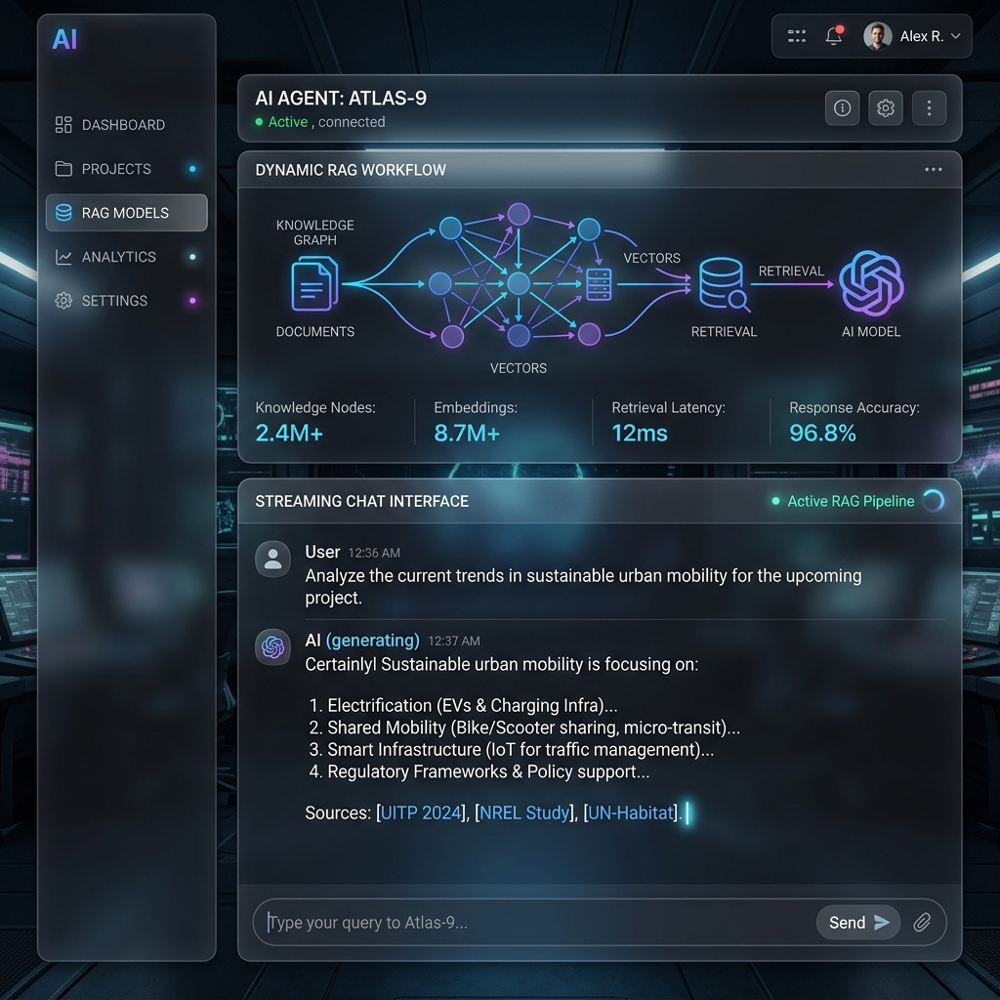
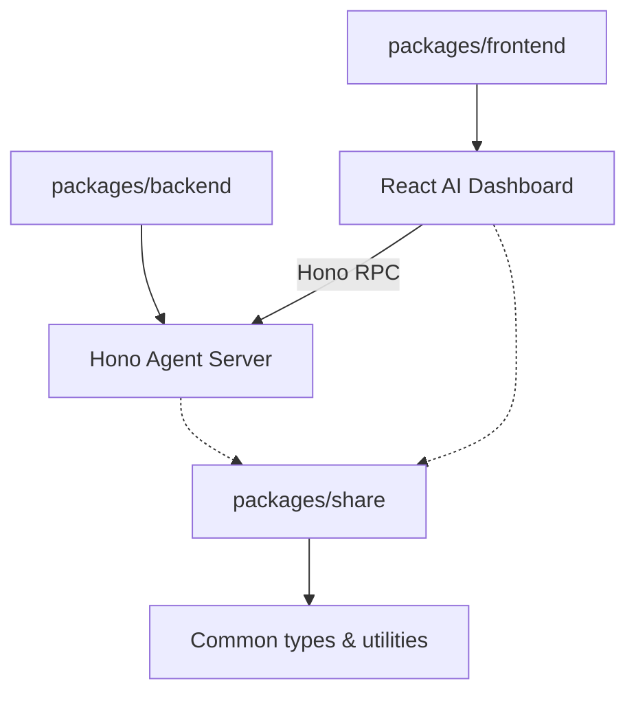

# 🌌 TS-AI-Agent Platform



> **A high-performance, full-stack AI Agent platform** featuring Retrieval-Augmented Generation (RAG), real-time streaming chat, and sophisticated agent orchestration. Built with the most modern TypeScript ecosystem.

---

## 💎 Features

- **🚀 Real-time Streaming**: Instant AI responses with low latency via Hono RPC and Server-Sent Events (SSE).
- **📚 Advanced RAG**: Seamless document ingestion and retrieval powered by `pgvector` and Prisma.
- **🏗️ Monorepo Architecture**: Clean, type-safe development using `pnpm` workspaces.
- **⚡ High Performance**: Ultra-fast backend with **Hono** and modern frontend with **Vite + React**.
- **🐳 Production Ready**: Fully containerized with Docker, featuring CI/CD-ready Dockerfiles.

---

## 🏗️ Project Structure

This project is a monorepo organized into three primary workspaces:



| Package | Role | Tech Stack |
| :--- | :--- | :--- |
| `packages/frontend` | Client-side UI | React, Vite, Tailwind CSS, Lucide |
| `packages/backend` | AI Agent Server | Hono, Node.js, Prisma, pgvector |
| `packages/share` | Shared Modules | TypeScript, Shared Schemas |

---

## 🛠️ Tech Stack

### Frontend
- **Framework**: React 19 (Vite)
- **Styling**: Tailwind CSS, Radix UI
- **Logic**: Hono RPC Client, React Router

### Backend
- **Framework**: Hono (Node.js Adapter)
- **Database**: PostgreSQL with `pgvector`
- **ORM**: Prisma
- **AI**: Custom LLM integration with streaming support

### Infrastructure
- **Package Manager**: pnpm 10
- **Deployment**: Docker, Docker Compose
- **Quality**: Prettier, ESLint, TypeScript 5.9+

---

## 🏁 Getting Started

### 1. Prerequisites

- [Node.js](https://nodejs.org/) (>= 20.0.0)
- [pnpm](https://pnpm.io/) (>= 10.0.0)
- [Docker](https://www.docker.com/) (for database and orchestration)

### 2. Installation & Setup

Clone the repository and run the automated setup script:

```bash
pnpm setup
```

This will:
- Install all dependencies
- Check environment variables (`.env`)
- Generate Prisma Client
- Push schema to the database (if available locally)

### 3. Environment Configuration

Copy the example environment file and fill in your AI provider credentials:

```bash
cp .env.example .env
```

### 4. Development

Start both the backend and frontend in development mode simultaneously:

```bash
pnpm dev
```

- Frontend: `http://localhost:5173`
- Backend: `http://localhost:3000`

---

## 🚢 Deployment (Docker)

To launch the entire platform in production mode:

```bash
docker-compose up --build
```

- **Frontend**: Accessible at `http://localhost:7777`
- **Backend API**: Accessible at `http://localhost:3001`
- **Postgres**: Running at `localhost:5432`

---

## 🧪 Maintenance

- **Database Management**: `pnpm db:studio` (Open Prisma Studio)
- **Linting**: `pnpm lint`
- **Formatting**: `pnpm format`
- **Clean**: `pnpm clean`

---

## 🛡️ License

This project is private and proprietary. All rights reserved.
